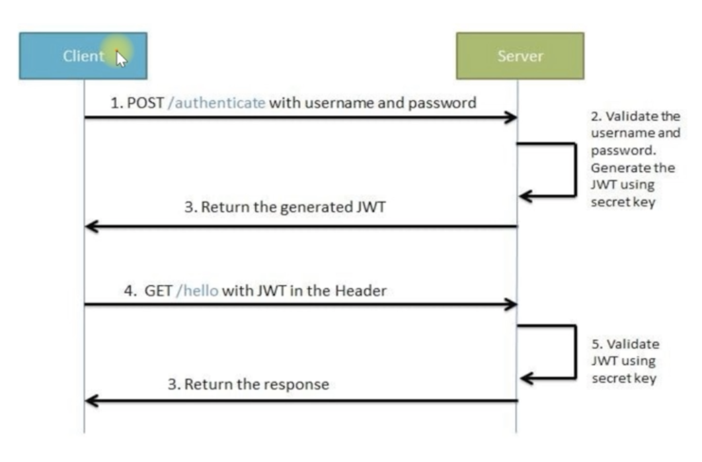
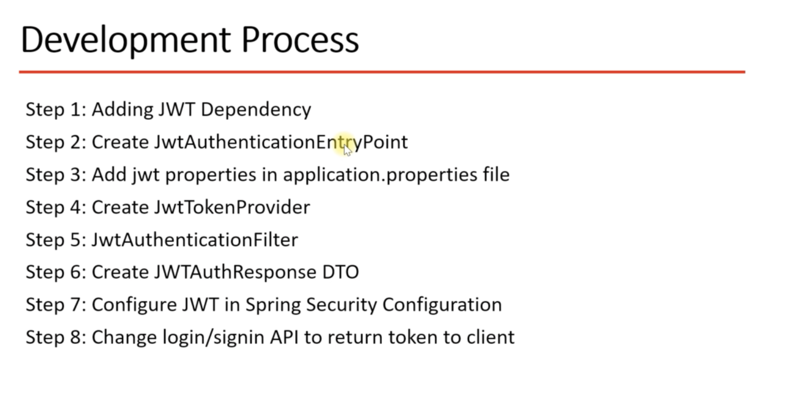

For database authentication,  we need to establish two entities.
* users
* roles

The relationship between the users and the roles entities would be many to many.
So, we need to introduce a table called user_roles , which keeps the user_id and role_id.

<h4>branch: git checkout database_authentication</h4>

<h3>JWT Authentication </h3>

 * JWT (JSON Web Token) is open standard and self-contained way for securely transmitting info as JSON object.
 * it's based on Stateless authentication mechanism.
 * we can use JWT for Authorization and Information Exchange.

<h4> Characteristics of JWT </h4> 
<link>https://jwt.io/</link>
    
    * Header, Payload, Signature.
    * Header usually keeps the algorithm and the type of authentication.
    * Payload the request body.

    * Signature Keeps the algorithm methods like base64UrlEncode(header) and payload.
    * ex: ndbvwjn325r828dbdh.cjncjbcbcab27217.nasbcabcab1wbhb2

